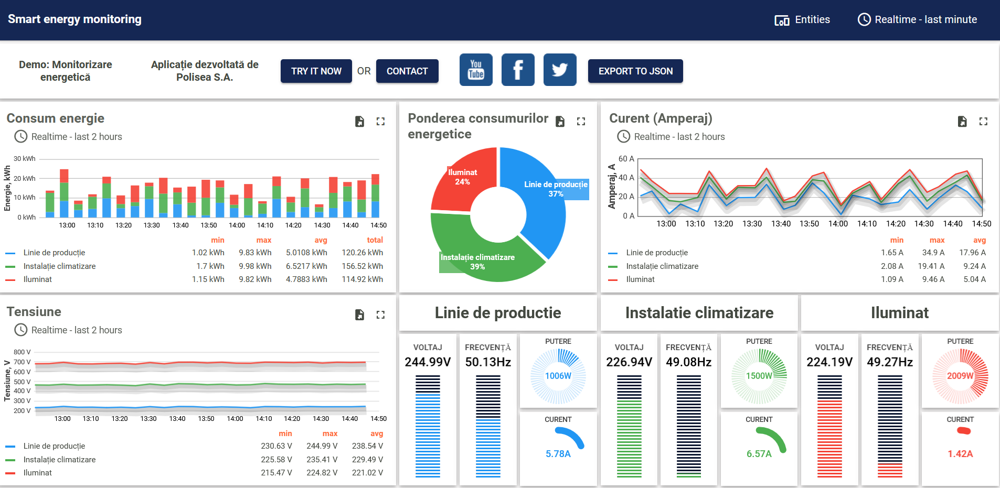

# Smart-energy-monitoring-with-ThingsBoard
Smart Energy Monitoring demo dashboard.

Overview

ThingsBoard platform provides out-of-the-box components and APIs to dramatically reduce time to market and our effort to create smart energy solutions and energy monitoring systems. 
Save up to 90% of development time for our smart energy solution by utilizing following benefits:

a.Reliable and fault tolerant data collection for our smart meters and energy monitors;
b.Advanced and flexible data visualization for real-time and historical smart energy monitoring;
c.Customizable end-user dashboards to analyze and share the results of energy efficiency monitoring;
d.Integration with third-party analytics frameworks and solutions for advanced electricity usage monitoring;
e.Enable energy management by utilizing ThingsBoard API to control and manage smart meters.
f.The platform provides production ready server infrastructure to connect your smart meter devices, collect, store and analyze energy monitoring data, 
  and share results of the analysis with your customers and end-users.

Generate random values use ThingsBoard rule chains,

  
Smart energy dashboard

Live Demo: https://myiot.polisea.ro/dashboard/e13d0a50-04ad-11ec-9fc0-d7ec4e17a89a?publicId=7cb71a20-041d-11ec-9fc0-d7ec4e17a89a

Alarm and Notification

I also try to create alarm notification for demo dashboard by ThingsBoard Rule Chains.

  
